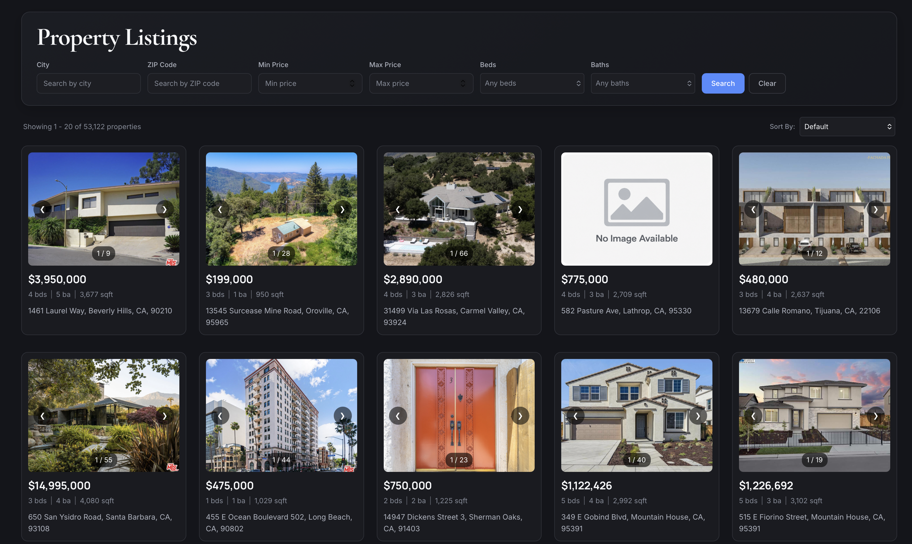

# IDX Property Search

A full-stack real estate property search application built with React, Express, and MySQL.

Users can browse property listings, apply filters, sort results, move through paginated results, and open a property detail page with photos, listing information, map location, remarks, and open-house information.

The project uses MLS/RETS-style property data, including legacy database column names and JSON-encoded fields.

---

## Screenshot



---

## Features

- Browse property listings
- Filter by city, ZIP code, price, bedrooms, and bathrooms
- Sort by price, date listed, square footage, and bedrooms
- Paginated results
- Property detail pages
- Image carousel and gallery
- Map display when coordinates are available
- Property remarks
- Open-house dates, times, and remarks
- Loading, error, and no-result states
- Backend input validation
- Automated frontend and backend tests

---

## Tech Stack

### Frontend

| Technology | Version |
| --- | --- |
| React | 19.2.7 |
| React Router DOM | 7.18.2 |
| Vite | 8.1.1 |
| Jest | 30.4.2 |
| React Testing Library | 16.3.2 |
| ESLint | 10.6.0 |

### Backend

| Technology | Version |
| --- | --- |
| Node.js | LTS recommended |
| Express | 5.2.1 |
| MySQL | 8.x |
| mysql2 | 3.22.5 |
| dotenv | 17.4.2 |
| cors | 2.8.6 |
| Nodemon | 3.1.14 |
| Jest | Dev dependency |
| Supertest | Dev dependency |

---

## Architecture

```text
React Frontend
      |
      | HTTP requests
      v
Express REST API
      |
      | Parameterized SQL
      v
MySQL Database
```

Main project structure:

```text
IDXPropertySearch/
├── backend/
│   ├── app.js
│   ├── db.js
│   ├── routes/
│   │   ├── health.js
│   │   └── properties.js
│   ├── tests/
│   │   └── properties.test.js
│   └── package.json
│
├── frontend/
│   ├── src/
│   │   ├── api/
│   │   ├── components/
│   │   ├── pages/
│   │   └── utils/
│   └── package.json
│
└── README.md
```

---

# Local Setup

## Prerequisites

Install:

- Git
- Node.js and npm
- Docker Desktop
- The database files:
  - `rets_property.sql`
  - `rets_openhouse.sql`

---

## 1. Clone the repository

```bash
git clone <repository-url>
cd IDXPropertySearch
```

---

## 2. Start MySQL

Make sure Docker Desktop is running.

Create the MySQL container:

```bash
docker run \
  --name idx-mysql-local \
  -e MYSQL_ROOT_PASSWORD=<your-password> \
  -e MYSQL_DATABASE=rets \
  -p 3306:3306 \
  -d mysql:8
```

If the container already exists:

```bash
docker start idx-mysql-local
```

Verify it is running:

```bash
docker ps
```

---

## 3. Import the database

Import the property table:

```bash
docker exec -i idx-mysql-local \
  mysql -u root -p<your-password> rets \
  < rets_property.sql
```

Import the open-house table:

```bash
docker exec -i idx-mysql-local \
  mysql -u root -p<your-password> rets \
  < rets_openhouse.sql
```

Verify the tables:

```bash
docker exec -it idx-mysql-local mysql -u root -p
```

Then run:

```sql
USE rets;

SHOW TABLES;

SELECT COUNT(*) FROM rets_property;
SELECT COUNT(*) FROM rets_openhouse;
```

Both tables should exist and contain data.

---

## 4. Configure the backend

```bash
cd backend
npm install
```

Create `backend/.env`:

```env
DB_HOST=127.0.0.1
DB_PORT=3306
DB_USER=root
DB_PASSWORD=<your-password>
DB_NAME=rets
PORT=5001
```

Do not commit `.env`.

Start the backend:

```bash
npm run dev
```

The backend should run at:

```text
http://localhost:5001
```

Verify the connection:

```bash
curl http://localhost:5001/api/health
```

Expected response:

```json
{
  "status": "ok",
  "database": "connected"
}
```

---

## 5. Start the frontend

Open a second terminal:

```bash
cd frontend
npm install
npm run dev
```

Vite will print a local development URL, normally:

```text
http://localhost:5173
```

Open that URL in a browser.

---

# API Reference

Base URL:

```text
http://localhost:5001
```

---

## GET `/api/health`

Checks whether the backend can connect to MySQL.

### Request

```bash
curl http://localhost:5001/api/health
```

### Response

```json
{
  "status": "ok",
  "database": "connected"
}
```

Possible status codes:

```text
200 - Database connected
500 - Database connection failed
```

---

## GET `/api/properties`

Returns paginated property listings.

### Query Parameters

| Parameter | Description | Default |
| --- | --- | --- |
| `limit` | Results per request, 1-100 | `20` |
| `offset` | Number of rows to skip | `0` |
| `city` | Filter by city | — |
| `zipcode` | Filter by ZIP code | — |
| `minPrice` | Minimum price | — |
| `maxPrice` | Maximum price | — |
| `beds` | Bedroom filter | — |
| `baths` | Bathroom filter | — |
| `sortBy` | Sort field | `id` |
| `sortOrder` | `ASC` or `DESC` | `ASC` |

Supported `sortBy` values:

```text
price
dateListed
sqft
beds
```

### Example Request

```bash
curl \
"http://localhost:5001/api/properties?city=Irvine&minPrice=500000&maxPrice=1000000&limit=20&offset=0"
```

### Example Response

```json
{
  "total": 487,
  "limit": 20,
  "offset": 0,
  "results": [
    {
      "id": 1,
      "L_ListingID": "12345678",
      "L_Address": "123 Main St",
      "L_City": "Irvine",
      "L_State": "CA",
      "L_Zip": "92612",
      "L_SystemPrice": 750000,
      "L_Keyword2": 3,
      "LM_Dec_3": 2,
      "LM_Int2_3": 1800
    }
  ]
}
```

### Invalid Request Example

```bash
curl "http://localhost:5001/api/properties?limit=500"
```

Response:

```json
{
  "error": "limit must be an integer between 1 and 100"
}
```

Status:

```text
400 Bad Request
```

---

## GET `/api/properties/:id`

Returns one property by its internal ID.

### Request

```bash
curl http://localhost:5001/api/properties/1
```

### Example Response

```json
{
  "id": 1,
  "L_ListingID": "12345678",
  "L_Address": "123 Main St",
  "L_City": "Irvine",
  "L_State": "CA",
  "L_Zip": "92612",
  "L_SystemPrice": 750000,
  "L_Keyword2": 3,
  "LM_Dec_3": 2,
  "LM_Int2_3": 1800,
  "L_Remarks": "Property remarks...",
  "YearBuilt": 2015,
  "LotSizeAcres": 0.15
}
```

### Not Found

```json
{
  "error": "Property with id 999999 not found"
}
```

Status:

```text
404 Not Found
```

### Invalid ID

```json
{
  "error": "id must be a positive integer within valid range"
}
```

Status:

```text
400 Bad Request
```

---

## GET `/api/properties/:id/openhouses`

Returns open houses for a property.

### Request

```bash
curl http://localhost:5001/api/properties/1/openhouses
```

### Example Response

```json
[
  {
    "L_ListingID": "12345678",
    "OpenHouseDate": "2026-09-10T00:00:00.000Z",
    "OH_StartTime": "10:00:00",
    "OH_EndTime": "13:00:00",
    "all_data": {
      "OpenHouseRemarks": "Open house remarks..."
    }
  }
]
```

If the property exists but has no open houses:

```json
[]
```

If the property does not exist:

```json
{
  "error": "Property with id 999999 not found"
}
```

Status:

```text
404 Not Found
```

---

# Database Schema

The application uses two main tables.

## `rets_property`

Stores property listings.

| Column | Description |
| --- | --- |
| `id` | Internal property ID |
| `L_ListingID` | MLS/RETS listing identifier |
| `L_Address` | Street address |
| `L_City` | City |
| `L_State` | State |
| `L_Zip` | ZIP code |
| `L_SystemPrice` | Price |
| `L_Keyword2` | Bedrooms |
| `LM_Dec_3` | Bathrooms |
| `LM_Int2_3` | Square footage |
| `L_Photos` | JSON photo data |
| `LMD_MP_Latitude` | Latitude |
| `LMD_MP_Longitude` | Longitude |
| `L_Remarks` | Property remarks |
| `YearBuilt` | Year built |
| `LotSizeAcres` | Lot size |
| `ListingContractDate` | Listing date |

---

## `rets_openhouse`

Stores open-house events.

| Column | Description |
| --- | --- |
| `L_ListingID` | Property listing identifier |
| `OpenHouseDate` | Open-house date |
| `OH_StartTime` | Start time |
| `OH_EndTime` | End time |
| `all_data` | JSON containing additional open-house data |

### Relationship

```text
rets_property.L_ListingID
          |
          | one-to-many
          v
rets_openhouse.L_ListingID
```

A property can have zero or multiple open-house records.

---

# Testing

## Backend

```bash
cd backend
npm test
```

Coverage:

```bash
npm run test:coverage
```

Backend tests cover:

- Property listing success
- Pagination
- Each filter type
- Invalid input
- Property detail success
- Invalid ID
- Property not found
- Open-house success
- Empty open-house results
- Unknown property

---

## Frontend

```bash
cd frontend
npm test
```

Coverage:

```bash
npm test -- --coverage
```

Frontend tests cover:

- `PropertyFilters`
- `Pagination`
- `PropertyCard`

Critical backend routes and frontend components meet the required 70%+ coverage target.

---

# Known Issues

- Some external property image URLs may expire.
- Some records contain missing or malformed photo data.
- Properties without both latitude and longitude do not display a map.
- Not every property has open-house information.

---

# Future Improvements

- Store filters, sorting, and pagination in URL query parameters
- Restore search state after returning from a property detail page
- Improve responsive layout on smaller screens
- Add authentication
- Add CI for automatic tests and linting
- Add production deployment configuration
